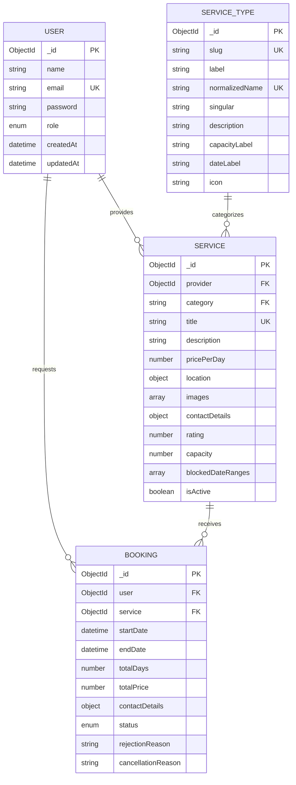

# Database Schema

Fetefolio uses MongoDB through Mongoose for persistent user, service-type, service and booking data. Redis stores only short-lived pending registrations.

## Relationships



`Service.category` stores the immutable `ServiceType.slug`. Mongoose does not enforce this as an ObjectId reference; the service layer verifies that the slug exists before a service is created or moved to another type.

## `users`

| Field                    | Type     | Rules                                              |
| ------------------------ | -------- | -------------------------------------------------- |
| `_id`                    | ObjectId | Primary key                                        |
| `name`                   | String   | Required, trimmed, 2–80 characters                 |
| `email`                  | String   | Required, lowercase, unique                        |
| `password`               | String   | Required bcrypt hash; excluded from normal queries |
| `role`                   | String   | `user` or `admin`; defaults to `user`              |
| `createdAt`, `updatedAt` | Date     | Mongoose timestamps                                |

Indexes: unique `email`.

## `servicetypes`

| Field                    | Type     | Rules                                           |
| ------------------------ | -------- | ----------------------------------------------- |
| `_id`                    | ObjectId | Primary key                                     |
| `slug`                   | String   | Required, unique, immutable category identifier |
| `label`                  | String   | Required display name                           |
| `normalizedName`         | String   | Required, unique, case-normalized name          |
| `singular`               | String   | Required singular display name                  |
| `description`            | String   | Required customer-facing description            |
| `capacityLabel`          | String   | Optional category-specific capacity label       |
| `dateLabel`              | String   | Required category-specific date label           |
| `icon`                   | String   | Optional icon name from the shared allow-list   |
| `createdAt`, `updatedAt` | Date     | Mongoose timestamps                             |

Indexes: unique `slug`; unique `normalizedName`.

## `services`

| Field                    | Type     | Rules                                                                |
| ------------------------ | -------- | -------------------------------------------------------------------- |
| `_id`                    | ObjectId | Primary key                                                          |
| `provider`               | ObjectId | Required reference to `users`; provider ownership boundary           |
| `title`                  | String   | Required, trimmed, case-insensitive unique value                     |
| `category`               | String   | Required service-type slug                                           |
| `description`            | String   | Required, maximum 3,000 characters                                   |
| `pricePerDay`            | Number   | Required, minimum 1                                                  |
| `location`               | Object   | Required `city`, `state`, `address`                                  |
| `images`                 | String[] | Up to eight validated image URLs at the API boundary                 |
| `contactDetails`         | Object   | Required `phone` and lowercase `email`                               |
| `rating`                 | Number   | 1–5, defaults to 4.5                                                 |
| `capacity`               | Number   | Optional descriptive guest/audience capacity                         |
| `blockedDateRanges`      | Object[] | Inclusive `{ _id, startDate, endDate }` public-availability closures |
| `isActive`               | Boolean  | Defaults to `true`                                                   |
| `createdAt`, `updatedAt` | Date     | Mongoose timestamps                                                  |

Indexes:

- text index on `title` and `description` for keyword search;
- case-insensitive unique index on `title`;
- compound index on `category`, `location.city`, `pricePerDay`, `rating`;
- individual indexes supporting provider, activity, category, city, price, rating and capacity filters.

## `bookings`

| Field                    | Type     | Rules                                                          |
| ------------------------ | -------- | -------------------------------------------------------------- |
| `_id`                    | ObjectId | Primary key and customer-facing booking reference source       |
| `user`                   | ObjectId | Required reference to the requesting customer                  |
| `service`                | ObjectId | Required reference to the requested service                    |
| `startDate`, `endDate`   | Date     | Required inclusive UTC interval                                |
| `totalDays`              | Number   | Required inclusive day count, minimum 1                        |
| `totalPrice`             | Number   | Required server-calculated snapshot                            |
| `contactDetails`         | Object   | Required name, phone and email; optional note                  |
| `status`                 | String   | `pending`, `confirmed`, `rejected`, `cancelled` or `completed` |
| `rejectionReason`        | String   | Present for provider-rejected pending requests                 |
| `cancellationReason`     | String   | Present for provider-cancelled confirmed bookings              |
| `createdAt`, `updatedAt` | Date     | Mongoose timestamps                                            |

Indexes: compound service/status/date index for provider workflows, and user/start-date index for customer history.

## Availability rule

`blockedDateRanges` is intentionally separate from booking status. A listing may represent multiple halls, rooms or other pooled units, so one confirmed booking does not necessarily exhaust inventory. Providers verify actual availability and close dates only when required. A new customer request conflicts when:

```text
blocked.startDate <= requested.endDate
AND blocked.endDate >= requested.startDate
```

## Redis pending registrations

Before email verification, Redis stores a record under a SHA-256-derived email key with the name, email, bcrypt password hash, HMAC OTP digest, attempt counters and timestamps. The record expires automatically after the configured OTP TTL and is removed after successful account creation.
